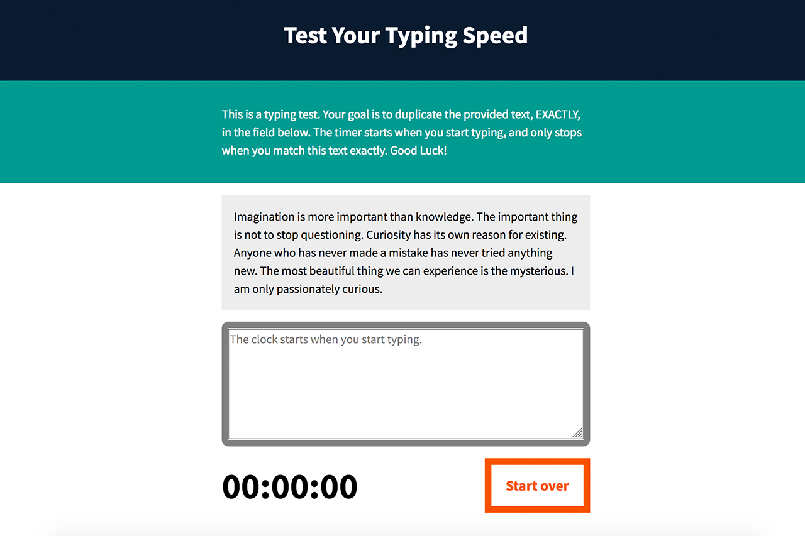

# Typing Speed Tester Application

An interactive application that’ll test your typing speed and accuracy to the given prompt. Used HTML, CSS and JavaScript. Use event listeners to detect typing, build a count-up timer, build a helper function for leading zeros, detect spelling errors by matching, stop the time when the test is done, and add a reset button. 

## Technology

* HTML
* CSS
* JavaScript

<kbd></kbd>

## Try Out Your Typing Skills

http://necessary-wren.surge.sh/